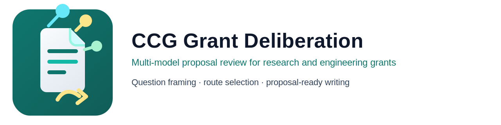

# CCG Grant Deliberation

[](https://github.com/LeoAKALiu/ccg-grant-deliberation/actions/workflows/ci.yml)
[](https://nodejs.org/)
[](./package.json)
[](./CHANGELOG.md)



中文 | [English](./README.en.md)

## About

`ccg-grant-deliberation` 是一个面向科技申请书、基金申报书与项目论证的 Codex 原生插件仓库。

它基于 [ccg-workflow](https://github.com/fengshao1227/ccg-workflow) 的多模型协同思路，收敛到单一目标：围绕一个申报主题组织多模型会审，并输出可直接进入申请书正文的结构化结果。

仓库当前聚焦三类工作：

- 判断问题是否成立，是否值得立项
- 比较候选路线，形成明确取舍
- 把会审结果转写为研究类或工程类申请书章节内容

## Features

- 多模型会审：组织 Gemini、Claude、GPT(Codex) 与 Codex Chair 完成立论、质询、裁决与汇总
- 申请书导向输出：生成关键科学问题、工程难点、最优技术路线、证据缺口与正文段落
- 模板支持：内置 `research` 与 `engineering`
- 研究模板增强：默认启用 strategy brief、claim-evidence alignment、reviewer simulation、style brief extraction
- 续跑能力：`research` 模式支持 checkpoint / resume
- 运行自检：提供 `setup` / `doctor`
- 降级运行：在可选 provider 缺失时仍可运行

## Quick Start

首次使用：

```bash
node scripts/setup.mjs
node scripts/doctor.mjs
```

## 在 Codex 中使用

本仓库按本地 Codex 插件组织，仓库根目录下已经包含：

- [.codex-plugin/plugin.json](/Users/leo/Projects/ccg-grant-deliberation/.codex-plugin/plugin.json)
- [skills/grant-deliberation/SKILL.md](/Users/leo/Projects/ccg-grant-deliberation/skills/grant-deliberation/SKILL.md)

使用方式：

1. 在 Codex 中打开这个仓库目录  
   `/Users/leo/Projects/ccg-grant-deliberation`
2. 先执行环境检查：

```bash
node scripts/setup.mjs
node scripts/doctor.mjs
```

3. 然后在 Codex 对话里直接提出任务，或显式调用插件 skill：

```text
请用 grant-deliberation 对这个课题做一轮 research 模板会审
```

也可以直接让 Codex 运行脚本：

```bash
node scripts/run-grant-deliberation.mjs \
  --template research \
  --topic "论证某科技项目申请书的关键科学问题、工程化难点和最优技术路线" \
  --material examples/materials/minimal-brief.md
```

如果环境未就绪，优先看 `doctor` 输出，而不是直接进入 live 运行。

通用报告：

```bash
node scripts/run-grant-deliberation.mjs \
  --topic "论证某科技项目申请书的关键科学问题、工程化难点和最优技术路线" \
  --material examples/materials/minimal-brief.md
```

研究类模板：

```bash
node scripts/run-grant-deliberation.mjs \
  --template research \
  --topic "论证某科技项目申请书的关键科学问题、工程化难点和最优技术路线" \
  --material examples/materials/minimal-brief.md
```

工程类模板：

```bash
node scripts/run-grant-deliberation.mjs \
  --template engineering \
  --topic "论证某科技项目申请书的关键科学问题、工程化难点和最优技术路线" \
  --material examples/materials/minimal-brief.md
```

研究类续跑：

```bash
node scripts/run-grant-deliberation.mjs \
  --template research \
  --resume-research \
  --topic "论证某科技项目申请书的关键科学问题、工程化难点和最优技术路线"
```

## Requirements

最低运行门槛：

- Node.js 18+
- `codex`

完整环境：

- `codex`
- `gemini`
- `claude`

## CLI

```bash
node scripts/run-grant-deliberation.mjs [options]
```

主要参数：

- `--topic <text>`：申报主题
- `--material <path>`：材料路径，可重复传入
- `--materials <a,b,c>`：逗号分隔材料列表
- `--language <lang>`：输出语言，默认 `zh-CN`
- `--focus <a,b,c>`：聚焦维度
- `--template <name>`：`research` 或 `engineering`
- `--resume-research`：显式从最近可恢复 checkpoint 续跑
- `--fresh-research`：忽略已有 checkpoint，从头运行
- `--task-timeout-ms <ms|infinite>`：单个 provider 子任务超时；`0` 或 `infinite` 表示无限等待
- `--run-timeout-ms <ms|infinite>`：整场运行超时；`0` 或 `infinite` 表示无限等待
- `--trace`：写入本地编排 trace
- `--output <path>`：指定输出路径

帮助：

```bash
node scripts/run-grant-deliberation.mjs --help
```

超时控制示例：

```bash
node scripts/run-grant-deliberation.mjs \
  --template research \
  --topic "论证某科技项目申请书的关键科学问题、工程化难点和最优技术路线" \
  --material examples/materials/minimal-brief.md \
  --task-timeout-ms 300000 \
  --run-timeout-ms 1800000
```

显式允许无限等待：

```bash
node scripts/run-grant-deliberation.mjs \
  --template research \
  --topic "论证某科技项目申请书的关键科学问题、工程化难点和最优技术路线" \
  --material examples/materials/minimal-brief.md \
  --task-timeout-ms infinite \
  --run-timeout-ms infinite
```

## Templates

### `research`

面向基金类、研究类申请书，重点输出：

- 研究目标
- 关键科学问题
- 研究内容
- 创新点
- 技术路线
- 可行性与风险

### `engineering`

面向工程类、落地类申请书，重点输出：

- 建设目标
- 工程难点
- 实施方案
- 阶段任务
- 预期成果
- 示范应用与风险控制

未传 `--template` 时，输出通用会审报告。

## Runtime

运行级别：

- `full`：`codex + gemini + claude`
- `partial`：`codex + (gemini 或 claude)`
- `minimal`：`codex`
- `blocked`：缺少 `codex`

运行结束时会输出实际参与方与 provider strategy summary。

默认行为仍然是有限超时；只有显式传入 `--task-timeout-ms infinite` / `--run-timeout-ms infinite`，或设置 `CCG_TASK_TIMEOUT_MS=infinite` / `CCG_RUN_TIMEOUT_MS=infinite` 时，才会禁用相应超时。

## Output

默认输出路径：

```text
ccg-grant-deliberation-<topic-slug>.md
```

主报告通常包含：

- 运行环境声明
- 议题归一化 brief
- 关键科学问题
- 工程难点
- 候选技术路线对比
- 最优技术路线与淘汰理由
- 证据缺口
- 可直接写入正文的段落
- 申报书章节映射（模板模式）

示例：

- [最小示例材料](./examples/materials/minimal-brief.md)
- [通用示例报告](./examples/output/example-report.md)
- [研究类示例报告](./examples/output/example-report-research.md)

## Checkpoint and Trace

`research` 模式默认启用本地 checkpoint / resume：

- 目录：`ccg-grant-deliberation-runs/`
- 阶段文件：`openings / pair-results / strategy / outline / compose / review / final-summary`

如需调试编排，可显式开启 trace：

```bash
node scripts/run-grant-deliberation.mjs --trace --template research ...
```

trace 目录：

- `ccg-grant-deliberation-runs/trace/`

这些文件仅用于本地续跑、阶段回溯与排障，不属于最终交付内容。

每次运行都会在工作目录的 `ccg-grant-deliberation-runs/` 下追加 `summary.md`，按阶段留下简要 Markdown 留痕，便于 checkpoint、续跑与用户透明化回溯。

## Repo Layout

```text
.
├── .codex-plugin/        # 插件 manifest
├── .github/workflows/    # CI 与 release workflow
├── assets/               # logo 与图标
├── docs/                 # 隐私、条款、发布文档
├── examples/             # 示例材料与示例输出
├── scripts/              # 主脚本、setup、doctor、校验脚本
├── skills/               # Codex skill 入口
└── tests/                # 单元测试
```

## Development

```bash
npm install
npm run check
npm run docs:check
npm run version:check
npm test
```

## Release

当前发布形态：

- 版本：`v0.3.1`
- 渠道：GitHub prerelease
- 发布规则：[CHANGELOG.md](./CHANGELOG.md)
- 发布流程：[docs/releasing.md](./docs/releasing.md)

## Limitations

- 当前模板仍是通用研究类 / 通用工程类，不区分具体资助机构
- 预算表、进度表、附件、伦理表等专门表单不在范围内
- 输出质量依赖输入材料质量与外部 provider 稳定性
- 人工审稿、事实核查与合规判断仍不可省略

## Privacy and Terms

- [Privacy Policy](./docs/privacy.md)
- [Terms of Use](./docs/terms.md)

## Acknowledgements

本项目的多模型会审思路来源于 [ccg-workflow](https://github.com/fengshao1227/ccg-workflow)。

`research` 模板中的 strategy brief、claim-evidence alignment、reviewer simulation 与 style brief extraction，吸收并改造自多个外部学术写作与研究技能仓库，目标是适配科技申请书，而不是通用论文写作流程。
